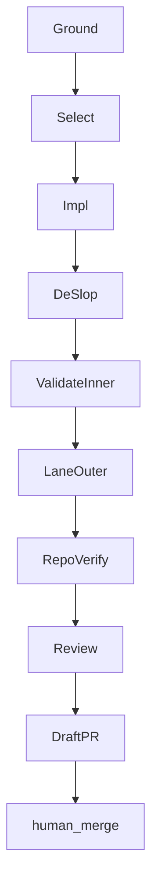

# Coverage Autonomous Loop (2026-09-04)

Sequential pipeline + De-Sloppify + draft-PR stop for momentstudio coverage WUs. Patterns only — **does not** install Continuous-Claude merge automation.

Decision SSOT (QZP): `quality-zero-platform/docs/plans/2026-09-04-fleet-autonomy-decision-log.md`  
Orchestration: `quality-zero-platform/docs/plans/2026-09-04-coverage-orchestration-contract.md`  
Matrix: [`2026-09-04-component-coverage-e2e-matrix.md`](./2026-09-04-component-coverage-e2e-matrix.md)

## Canonical stages (nine discrete)

```bash
# 1 Ground  2 Select  3 Impl  4 DeSlop  5 ValidateInner
# 6 LaneOuter  7 RepoVerify  8 Review  9 DraftPR — STOP (G-3). No merge.
```



## Cross-iteration bridge

`SHARED_TASK_NOTES.md` or `docs/coverage-runs/<id>/NOTES.md` listing:

- components done / remaining
- last INNER/OUTER/REPO receipts
- blockers (`secrets`, `stack`, `never-touch`, `base_ref`)
- next component path
- `failed[]` (never silent-pending)

Redact secrets in NOTES the same as PRs/logs.

## Done vs audit status

ResumeManifest `done` = WU done-predicate met (may still have `OUTER-STATUS: outer:blocked`). QZP audit `partial` = live visual contexts missing — orthogonal; do not equate `done` with full-green fleet audit.

**Done:** INNER ∧ LANE_OUTER ∧ REPO_VERIFY ∧ Review.

## ResumeManifest

Path: `docs/coverage-runs/<run_id>/manifest/`

- Append-only `done.jsonl` `{ts, wu_id, state, meta}` with `state ∈ {partial, done, failed}`
- Ordered: `--mark-partial` → three-layer receipt + Review PASS → **DraftPR (idempotent)** → `--mark-done` or `--mark-failed`
- DraftPR: resolve existing draft by `wu_id`/branch/component; reuse URL; refuse second open
- `--mark-done` never from ValidateInner / `UNIT-COMPLETE` alone
- Drivers: `--ids --next` and `--resume --json`

## H6 timeout contracts

Every WU uses `settle()` / `withTimeout()`. Prefer `pipeline()` over bare parallel barriers. Typed drop-receipts. Barrier-without-timeout = lint reject. Document `H6_TIMEOUT_MS` / `H6_STALL_MS` (or explicit per-WU ms). Docs phase records; build wires helpers.

## Circuit breakers

| Breaker | Cap |
| --- | --- |
| Max concurrent coding agents / repo | 4 |
| Max runs / coverage batch | 20 |
| Max cost / batch | HARD `budget.total` required; refuse if unset |
| Identical-fail escalate | N=3 |
| Max draft-PR revisions / WU | 3 |
| Visual secrets missing | `outer:blocked`; no burn loops |

## Patterns rejected this phase

| Pattern | Why |
| --- | --- |
| Continuous Claude auto-merge | Violates G-3 |
| Infinite agentic loop | Wrong fit |
| Ralphinho DAG + merge queue | FORBIDDEN under G-3/G-25 |
| Unbounded `claude -p` without max-runs/cost | Violates G-12/13 |

## Fleet loop appendix (record-only until G-20)

Audit → classify → branch via WorkerAdapter → sequential pipeline → draft PR → poll checks (no merge) → fix or `blocked` → re-audit. Completion signal example: `COVERAGE_LANE_BATCH_COMPLETE` — never a merge signal.
